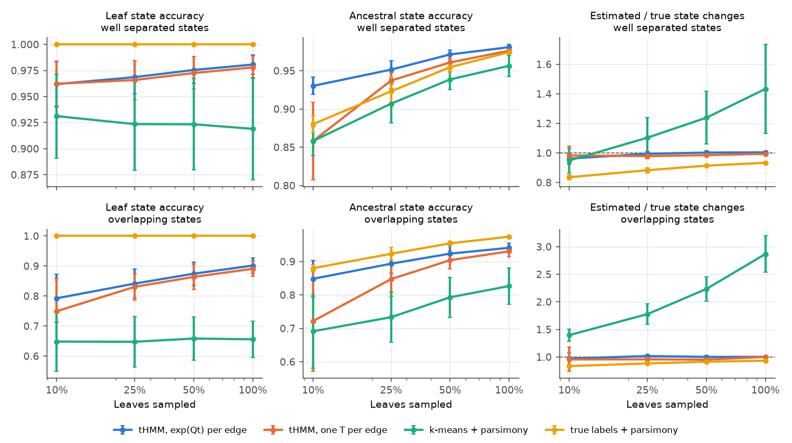
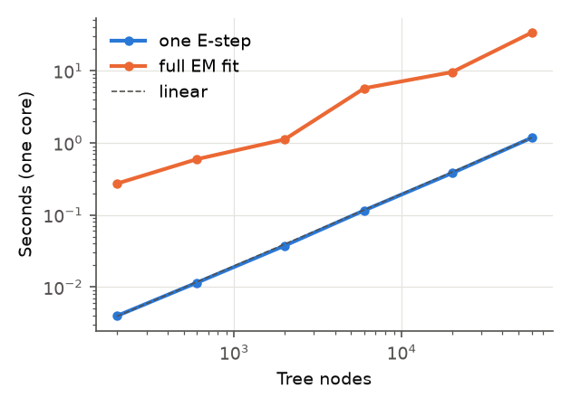
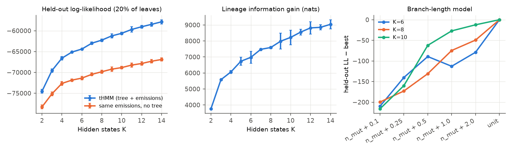
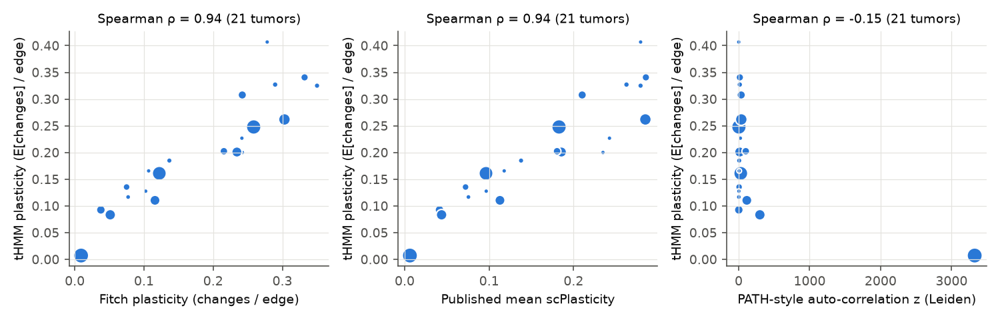
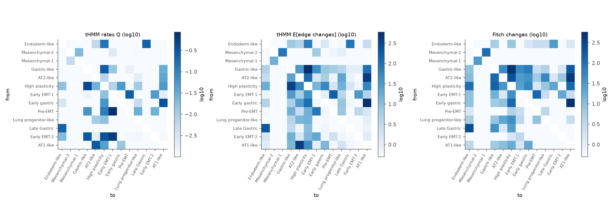
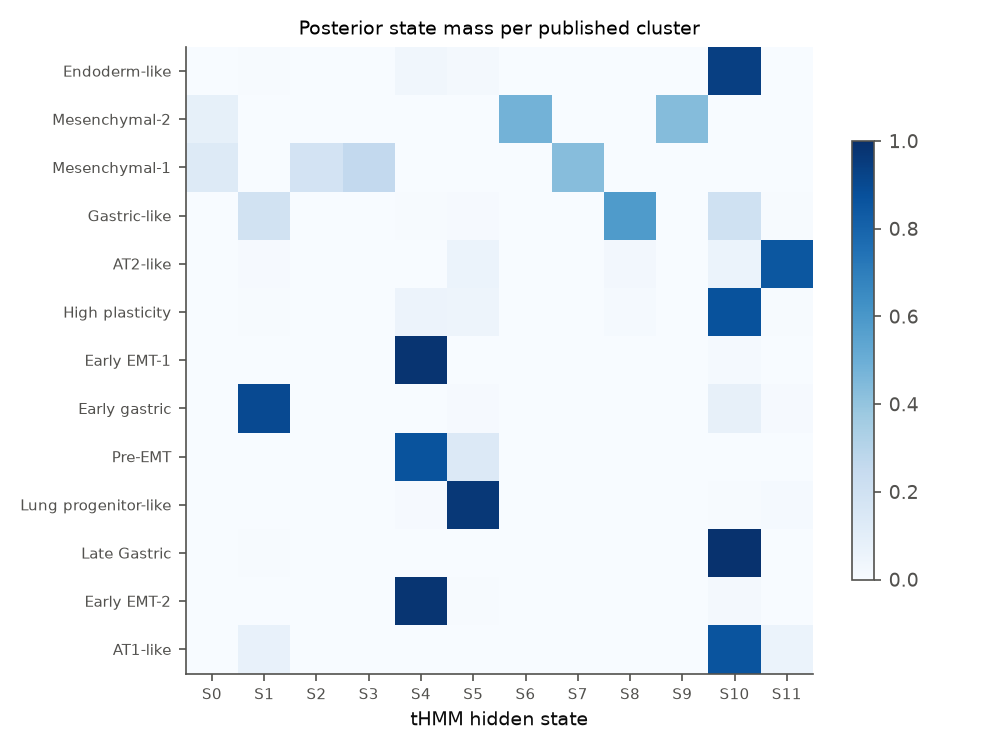

# Latent-state tHMM on CRISPR lineage-recorder phylogenies: KP-Tracer report (#1014)

## Summary

The tHMM now fits reconstructed phylogenies directly. Each edge has its own transition matrix exp(Q·t_e). Hidden states have Gaussian emissions on a cell embedding and are observed only at the leaves. Q is estimated by an exact EM step. In simulation this model recovers rates, emissions and ancestral states even at 10% leaf sampling. Its expected numbers of state switches are unbiased. Cluster-then-parsimony instead over-counts switches by 1.4–2.9× when states overlap, and under-counts them even when given the true labels.

On 21 KP-Tracer sgNT primary tumors (28,939 cells), the tHMM reproduces the published tumor-level plasticity ranking. Its Spearman ρ is 0.94 against Fitch parsimony and 0.94 against the published mean scPlasticity. It also reproduces the paper's qualitative picture: AT2-like is the most likely root state and is stable, while High-plasticity, AT1-like and the gastric/endoderm states are the most plastic.

The model adds three things parsimony does not provide:

1. **Direction of switches.** Some flows are strongly directed and robust to resampling tumors: Early gastric → AT1-like, Gastric-like → AT1-like, Late gastric → Endoderm-like, and Early EMT-1 → Pre-EMT. Others that Fitch reports as one-way, AT2 ↔ AT1 and Gastric-like ↔ High-plasticity, are bidirectional under the model. Yang et al. note they "were limited in our ability to describe the directionality of transitions".
2. **A lineage information gain.** Knowing the tree improves the held-out prediction of a masked cell's expression by about 1.5 nats per cell.
3. **Posterior uncertainty** for every ancestor and edge.

**Main limitations:**

- Only two to four tumors carry the Pre-EMT, Late gastric, Early EMT-2 and Lung-progenitor states. Both Mesenchymal states occur only in 3724_NT_T1, a nearly star-shaped tree, so conclusions about them are weak.
- The unsupervised model allocates states by cell density, not biology. It splits the abundant Mesenchymal cells and merges several small epithelial states.
- Mutation counts on edges carry essentially no information beyond the topology.

## What was built

| Issue task | Implementation |
|---|---|
| Tree ingestion | `lineage/tree_io.py`. Reads Newick, networkx or `CassiopeiaTree` into CSR with the root at 0 and nodes in BFS order, and names unnamed nodes. Also prunes to cells with expression, collapses unifurcations (summing branch lengths), aligns leaves to `obs_names`, and computes Cassiopeia-style LCA ancestral alleles and per-edge mutation counts. |
| Multivariate Gaussian emission | `lineage/states/StateDistributionGaussian.py`. Diagonal-plus-ridge covariance. All-NaN rows (internal nodes, masked leaves) have log-likelihood 0; partially missing rows are marginalized. |
| Log-space emissions | `get_log_Emission_Likelihoods` and `get_scaled_Emission_Likelihoods` in `lineage/LineageTree.py`. Subtracting the per-node maximum is exact: it rescales only that node's normalizing factor. The upward pass also needed log-space products (`get_beta_and_logNF`), because KP-Tracer polytomies with thousands of children overflow `np.prod`. |
| Per-edge exp(Qt) and Q M-step | `lineage/HMM/E_step.py` accepts either a shared (K×K) or a per-edge (N×K×K) transition array; the existing code path is unchanged. `lineage/ctmc.py` computes exp(Qt) by eigendecomposition. It also implements the endpoint-conditioned EM of Hobolth & Jensen (2011). The expected dwell times and jump counts need one eigendecomposition per iteration plus O(K²) work per edge. |
| Edge-wise joint posterior and switch counts | `get_edge_posteriors` in `lineage/HMM/M_step.py` gives P(z_p = k, z_c = l \| Y) for every edge. `PhyloHMM.switch_summary` reports expected k→l edge changes, CTMC jumps (including reversions within an edge), per-edge change probabilities, and plasticity and heritability per tree. |
| Model | `lineage/phyloHMM.py` (`PhyloHMM`). EM with k-means initialization and several restarts. Offers `ctmc` or `discrete` (one T per edge, for division-resolved trees) modes, fixed or free emissions, BIC, and held-out leaf likelihood with an optional tree-free baseline. |
| Baselines | `lineage/phylo_stats.py`: unit-cost Sankoff/Fitch–Hartigan small parsimony on multifurcating trees; PATH-style Moran's I with inverse node-distance weights and permutation z-scores. |
| Simulation | `lineage/phylo_sim.py`: Yule trees, CTMC states along branches, Gaussian leaves, leaf subsampling with pruning. |
| Tests | `lineage/tests/test_phyloHMM.py`, 19 tests. They check the E-step against brute-force enumeration of all state assignments on a multifurcating tree (log-likelihood, node marginals, edge joints) in both modes. They check the CTMC statistics against numerical quadrature, a 5,000-child polytomy, underflow at D = 300, the loader, parsimony, EM monotonicity and Q recovery. The existing 67 tests pass unchanged. |

Analysis scripts, CSV results and figures are in this directory; see [README.md](README.md).

## Open questions from the issue

- **Tree format.** `KPTracer-Data/trees/*_tree.nwk` are plain Newick with leaf names only: no branch lengths, and many unifurcations. Each tree has a per-tumor `*_character_matrix.txt` (cells × cut sites, `-` = missing) and a `*_priors.pkl`. Branch lengths therefore come from mutation counts on edges, after LCA reconstruction as in the Cassiopeia release. Many edges carry no new mutation (14–96% per tumor, mostly leaf edges hanging off polytomies), so edge length is t = n_mut + δ.
- **Embedding.** The h5ad provides the 10-dimensional batch-corrected `X_scVI` that the published Leiden clusters were built on, so scVI is the primary embedding. PCA (top 2,000 variable genes, 10 PCs, not batch-corrected) is the sensitivity analysis. The two unsupervised K = 12 fits agree only moderately with each other (ARI 0.57), and about equally with the Leiden labels (NMI 0.71 for scVI, 0.70 for PCA).
- **Published scores.** The Zenodo release includes `plasticity_scores.tsv` with per-cell scPlasticity, used directly below. My own Fitch implementation reproduces the published tumor ranking (ρ = 0.96 against the mean published scPlasticity).

## Simulation study

`simulation_study.py`, figures `figures/simulation_accuracy.png` and `figures/simulation_Q_error.png`.

- **Setup:** 20 Yule trees of 500 leaves each; K = 4 states in a progression-like chain (0 → 1 → 2 → 3 with slow reversions); 10-dimensional Gaussian emissions with unit noise. Means are either well separated (scale 1.0) or overlapping (scale 0.5), and leaf sampling runs from 100% down to 10%. Each setting has 5 replicates; each fit keeps the best of 3 starts.
- **Compared methods:** the tHMM (exp(Qt) per edge, or one T per edge ignoring lengths), k-means labels followed by Fitch parsimony, and true leaf labels followed by Fitch parsimony (an oracle).

| states | leaves sampled | method | leaf acc. | ancestral acc. | est./true switches | Q rel. error |
|---|---|---|---|---|---|---|
| separated | 100% | tHMM exp(Qt) | 0.98 | **0.98** | **1.00** | 0.09 |
| | | k-means + parsimony | 0.92 | 0.96 | 1.43 | – |
| | | true labels + parsimony | 1.00 | 0.97 | 0.93 | – |
| separated | 10% | tHMM exp(Qt) | 0.96 | **0.93** | **0.96** | 0.18 |
| | | tHMM one T | 0.96 | 0.86 | 0.98 | – |
| | | k-means + parsimony | 0.93 | 0.86 | 0.95 | – |
| | | true labels + parsimony | 1.00 | 0.88 | 0.84 | – |
| overlapping | 100% | tHMM exp(Qt) | **0.90** | 0.94 | **1.00** | 0.09 |
| | | k-means + parsimony | 0.66 | 0.83 | 2.87 | – |
| overlapping | 10% | tHMM exp(Qt) | **0.79** | **0.85** | **0.97** | 0.73 |
| | | tHMM one T | 0.75 | 0.72 | 0.96 | – |
| | | k-means + parsimony | 0.65 | 0.69 | 1.40 | – |
| | | true labels + parsimony | 1.00 | 0.88 | 0.84 | – |

Observations:

- **Switch counts are unbiased only for the tHMM.** Parsimony is a minimum, so it under-counts even with the true labels (0.84–0.93×). With estimated labels, every misclassified leaf adds a spurious switch, so it over-counts (up to 2.9×). The error gets *worse* as more leaves are sampled.
- **Ancestral states improve on even oracle parsimony when sampling is sparse.** With separated states and 10% sampling, the tHMM reaches 0.93 against 0.88 for parsimony on true labels. It pools evidence across the subtree and uses branch lengths.
- **Branch lengths matter under sparse sampling.** At 10% sampling, ignoring them (one T per edge) costs 7–13 points of ancestral accuracy. Pruned, subsampled trees have very uneven edge lengths.
- **Q is well identified with dense sampling or separated states** (relative error ≤ 0.18). With overlapping states and 10% sampling it degrades (0.73) because the small rates are poorly determined; the large rates stay within about 30%.

## Scalability

`scalability.py`, `figures/scalability.png`. Runtime on one core is linear in tree size. One E-step takes 4 ms on 199 nodes, 0.38 s on 20k nodes and 1.2 s on 60k nodes. A full EM fit takes 0.27 s at 100 leaves and 34 s at 30,000 leaves. The whole KP-Tracer cohort (21 trees, 45k nodes) fits in about 1 minute per start.

**Comparison with BDMM-Prime on a 100-cell tree** (`bdmm_comparison.py`, `results/bdmm_thmm.json`). Both methods get the same simulated 100-leaf time tree, the true tip types (4 types), and the same branch lengths.

- **tHMM:** fits in 0.4 s, with emissions fixed at near-indicators of the tip type. A 200-replicate parametric bootstrap takes 165 s, and its 95% intervals cover all 12 true rates. The four large rates are recovered in the right order: 0→1 at 0.69 (true 0.45), 1→0 at 0.27 (0.15), 1→2 at 0.26 (0.30), 2→3 at 0.14 (0.24). With only 34 true switches on the tree, the small rates go to the zero boundary.
- **BDMM-Prime:** BDMM_RESULTS_PLACEHOLDER

## KP-Tracer analysis

### Data

- **Tumors:** filtered as in Yang et al. (Figure 4 notebook of KPTracer-release): sgNT primary tumors with a tree, ≥100 cells, >5% unique alleles and >20% unsaturated targets. This leaves 21 tumors.
- **Cells:** leaves are restricted to cells present in `adata_processed.nt.h5ad`. Leiden clusters holding ≤2.5% of a tumor are dropped, and unifurcations are collapsed. This leaves 28,939 cells in trees of 188 to 14,817 nodes.
- **3724_NT_T1** contributes half of the cells (14,480) but is almost a star: 96% of its edges carry no new mutation.

### Model selection

`kptracer_analysis.py select`, `figures/model_selection.png`, `results/model_selection.csv`. For each K from 2 to 14 there are 3 replicates. Each replicate masks 20% of leaves, fits the model, and scores the masked cells by their predictive density. The **lineage information gain** compares that score against a tree-free prediction that uses the same emissions but population-wide state frequencies.

- Held-out likelihood and BIC improve monotonically up to K = 14. As expected for a mixture on a continuous embedding, neither picks a small K.
- The lineage gain is large at every K: 3.8k nats at K = 2 and 8.8k at K = 12, over about 5.8k masked cells. Returns diminish past K ≈ 12, so the unsupervised model uses K = 12.
- **Branch lengths.** Held-out likelihood increases steadily from t = n_mut + 0.1 through n_mut + 2 to unit lengths (t = 1 on every edge), which score best. The differences are small (≤ 220 nats, against a lineage gain of about 8,000). The fixed-emission fits agree: the log-likelihood is −303.0k for δ = 0.1, −302.5k for δ = 0.5, −302.1k for δ = 2 and −302.0k for unit lengths. So the number of recorder mutations on an edge is not a useful proxy for how many divisions or how much time the edge spans. All tumor-level conclusions below hold across these choices (see the sensitivity table).

### Cluster-anchored model: published states, learned dynamics

To compare with Yang et al. on their own state definitions, there is one hidden state per published Leiden cluster (13 remain after filtering). **Emissions are fixed** at each cluster's Gaussian in scVI space, and Q and π are learned. Emissions must be fixed: letting them move (`anchored_freeE`) makes EM repurpose states. The Pre-EMT Gaussian absorbs half of the Mesenchymal-2 cells in 3724_NT_T1, and the Endoderm-like state ends up covering none of its own cells. The share of cells whose most likely state matches their own cluster then falls from 0.94 (fixed emissions) to 0.70.

**Tumor-level plasticity.** Plasticity is the expected number of edge state changes divided by the number of edges; `results/tumor_benchmarks_anchored.csv`.

| comparison (21 tumors, Spearman ρ) | main (δ = 0.5) | without 3724_NT_T1 | δ = 0.1 | δ = 2 | unit lengths | free emissions |
|---|---|---|---|---|---|---|
| tHMM vs. Fitch plasticity | **0.94** | 0.93 | 0.92 | 0.95 | 0.95 | 0.52 |
| tHMM vs. published mean scPlasticity | **0.94** | 0.93 | 0.88 | 0.93 | 0.91 | 0.46 |
| Fitch (ours) vs. published | 0.96 | 0.96 | 0.96 | 0.96 | 0.96 | 0.96 |
| tHMM vs. PATH-style auto-correlation z | −0.15 | −0.01 | −0.15 | −0.10 | −0.15 | 0.10 |
| Fitch vs. PATH-style auto-correlation z | −0.01 | 0.13 | −0.01 | −0.01 | −0.01 | −0.01 |
| per-cell tHMM vs. published scPlasticity (median within tumor) | 0.45 | 0.44 | 0.47 | 0.34 | 0.45 | 0.38 |
| pooled k→l matrix, tHMM vs. Fitch | 0.79 | 0.74 | 0.78 | 0.78 | 0.78 | 0.65 |
| total edge changes, tHMM / Fitch | 4,125 / 3,888 | 4,029 / 3,753 | 4,372 / 3,888 | 3,717 / 3,888 | 3,518 / 3,888 | 8,228 / 3,888 |
| total CTMC jumps | 7,321 | 7,305 | 25,550 | 4,732 | 4,152 | 11,869 |

- tHMM plasticity tracks both parsimony and the published scores closely. The expected number of edge changes is about 6% above the Fitch minimum, as the simulations predict. The CTMC jump count is higher still because it includes reversions within an edge. It depends strongly on δ, since short edges force the model to explain changes with high rates. Jump counts are therefore not interpretable in absolute terms without a time-calibrated tree.
- PATH-style phylogenetic auto-correlation measures something else. Its z-score mostly tracks tumor size (ρ = 0.54 with cell count) and whether states segregate into whole clades. For example, 3724_NT_T1 has near-zero per-edge plasticity and z ≈ 3,300. Neither parsimony nor the tHMM per-edge plasticity is related to it across tumors. Per-edge switching (Fitch, tHMM) and phylogenetic correlation (PATH) should not be treated as interchangeable measures of "plasticity".

**Per-state stability.** `results/state_table_anchored.csv`. The table shows P(child = k | parent = k) pooled over edges, with 95% intervals from 48 tumor-bootstrap refits.

| state | cells (tumors) | tHMM stay prob. [95% CI] | Fitch stay | published scPlasticity | root posterior [95% CI] |
|---|---|---|---|---|---|
| Mesenchymal-1 | 5,527 (1) | 0.997 [0.10, 1.00] | 0.995 | 0.002 | 0.05 |
| Mesenchymal-2 | 8,953 (1) | 0.990 [0.11, 0.99] | 0.988 | 0.009 | 0.00 |
| Lung progenitor-like | 880 (4) | 0.975 [0.55, 1.00] | 0.928 | 0.158 | 0.00 |
| **AT2-like** | 3,884 (19) | **0.915 [0.88, 0.94]** | 0.889 | 0.115 | **0.47 [0.04, 0.70]** |
| Late Gastric | 675 (2) | 0.816 [0.28, 0.83] | 0.755 | 0.227 | 0.00 |
| Gastric-like | 2,747 (13) | 0.809 [0.50, 0.87] | 0.784 | 0.276 | 0.03 |
| Early EMT-1 | 1,010 (5) | 0.804 [0.57, 0.91] | 0.846 | 0.189 | 0.08 |
| Endoderm-like | 476 (7) | 0.749 [0.24, 0.78] | 0.719 | 0.293 | 0.00 |
| Early gastric | 1,717 (6) | 0.735 [0.39, 0.75] | 0.735 | 0.289 | 0.21 |
| **High plasticity** | 1,465 (18) | **0.580 [0.43, 0.65]** | 0.593 | 0.250 | 0.02 |
| **AT1-like** | 1,408 (14) | **0.474 [0.28, 0.57]** | 0.795 | 0.206 | 0.02 |
| Pre-EMT | 165 (2) | 0.427 [0.00, 0.50] | 0.750 | 0.156 | 0.07 |
| Early EMT-2 | 32 (2) | 0.267 [0.00, 0.54] | 0.714 | 0.197 | 0.06 |

- The ranking agrees with Fitch (ρ = 0.81) and runs opposite to published per-cell plasticity (ρ = −0.48), as it should. It also matches the paper's statements: AT2-like and Mesenchymal "represented the most stable states", and High-plasticity, Gastric-like and Endoderm-like "exhibited high EffectivePlasticity".
- **AT2-like** is the most likely state of the tumor MRCA (0.47, the largest mass). It is also one of the most stable states that is supported by many tumors (19). This fits the paper's "initial, stable alveolar-type2-like state".
- **AT1-like** is much less stable under the tHMM (0.47) than under Fitch (0.80). Most of its switches are on the AT2 ↔ AT1 and Early gastric → AT1 axes (flow table below). Fitch's minimum-change labeling can absorb such isolated leaf-level switches into a single change at a polytomy, which likely explains the gap.
- **Rare states:** intervals are wide for states present in one or two tumors. The Mesenchymal stability estimate rests entirely on 3724_NT_T1.

**Direction of transitions.** `results/flows_anchored.csv`, `figures/transitions_anchored.png`. The table lists pooled expected CTMC jumps in each direction and the fraction of tumor-bootstrap refits that agree on the net direction.

| flow | forward | reverse | bootstrap agreement |
|---|---|---|---|
| Early gastric → AT1-like | 686 | 38 | **0.98** |
| Late Gastric → Endoderm-like | 293 | 165 | **0.98** |
| Mesenchymal-2 → Mesenchymal-1 | 86 | 15 | 0.94 (1 tumor) |
| Early EMT-1 → Pre-EMT | 449 | 323 | 0.92 |
| Gastric-like → AT1-like | 124 | 0 | 0.92 |
| Endoderm-like → High plasticity | 101 | 32 | 0.79 |
| AT2-like → High plasticity | 146 | 54 | 0.77 |
| Gastric-like → Early EMT-1 | 57 | 1 | 0.71 |
| AT1-like ↔ AT2-like | 900 | 835 | 0.65 (bidirectional) |
| Gastric-like ↔ High plasticity | 1,139 | 975 | 0.60 (bidirectional) |

- **Fitch direction can be an artifact.** Parsimony on the same labels reports AT2 → AT1 422 times and AT1 → AT2 only 9 times. That direction most likely comes from its tie-breaking, which keeps the parent's label and roots the tree in the majority state. The tHMM finds that axis bidirectional. For Early gastric → AT1-like the two methods agree (568 vs. 19 for Fitch). Both are consistent with the paper's observation that "AT1-like and Early Gastric states clustered together".
- **The paper's route toward EMT.** It proposes that tumors leave AT2 through gastric/endoderm-like or lung-mixed states and then enter EMT. The model's net flows point that way: AT2-like → High plasticity, Endoderm-like → High plasticity, Gastric-like → Early EMT-1, and Early EMT-1 → Pre-EMT. Only Early EMT-1 → Pre-EMT clears 0.9 bootstrap agreement, and the EMT states occur in only 2–5 tumors. These are hypotheses to test on more tumors, not established paths.

### Unsupervised model (K = 12)

`fit_unsup`, `figures/unsup_vs_clusters.png`. Agreement with the Leiden labels is NMI 0.71 (ARI 0.51).

- **Recovered as distinct states:** AT2-like (with 0.63 of the root mass), Early gastric, Gastric-like, Lung-progenitor and Early EMT.
- **Split:** six of the 12 states divide the Mesenchymal cells of 3724_NT_T1, and three of those sub-states switch rapidly (exit rates 1.2–1.8).
- **Merged:** AT1-like, High-plasticity, Endoderm-like and Late gastric collapse into one state.

Without 3724_NT_T1, the same fit separates High-plasticity, Late gastric/Endoderm, Lung-progenitor and AT1-like into their own states. Maximum-likelihood state discovery puts states where cells are dense, not where biology is resolved. For discovery on data like this, the most useful next steps are per-tumor weighting, hierarchical K, or anchoring on known programs.

## Conclusions

1. **The generalization is correct and fast.** Per-edge exp(Qt) transitions, leaf-only Gaussian emissions and exact CTMC EM make the tHMM a practical model for recorder phylogenies. It matches brute-force enumeration exactly and scales linearly, taking about 1 minute per start for 29k cells.
2. **It beats cluster-then-parsimony.** In simulation it gives unbiased switch counts and better ancestral states, especially under the heavy leaf subsampling typical of recorder data.
3. **It reproduces the published results.** On KP-Tracer, tumor-level plasticity matches the published scores (ρ = 0.94), AT2-like is identified as the stable root state, and the states the paper calls highly plastic come out as the least stable.
4. **Directionality is the clearest new result.** A non-reversible Q separates robustly directed flows (Early gastric → AT1-like, Late gastric → Endoderm-like, Early EMT-1 → Pre-EMT) from bidirectional ones (AT1 ↔ AT2, Gastric-like ↔ High-plasticity). Parsimony misassigns direction on the latter. The source paper said this was beyond its methods.
5. **Caveats on KP-Tracer:**
   - Mutation-count branch lengths are uninformative: unit lengths fit as well or better.
   - Several states are supported by only one to four tumors.
   - Unsupervised state discovery is density-driven.
   - Absolute rates and CTMC jump counts depend on the branch-length model and need a time-calibrated tree before they can be read as per-division or per-day rates.

## Suggested next steps

- Replace n_mut + δ with branch lengths estimated jointly with the tree, e.g. Cassiopeia's `IIDExponentialMLE` on the character matrices. Alternatively, learn a per-tumor length scale inside the EM.
- Weight tumors equally in the Q M-step, or use a hierarchical Q, so that one 14k-cell tumor does not dominate the pooled rates.
- Extend to the metastatic families (`*_Fam` trees) and to the KPL/KPA genotypes, which the paper reports have new trajectories. Test whether Q differs by genotype with a likelihood-ratio or bootstrap test.
- Run the spatial extension (deferred here) on Zenodo 19771805, and validate on the division-resolved baseMEMOIR trees using the existing `discrete` mode.

## Not done

- **Spatial stretch goals:** skipped, as requested.
- **baseMEMOIR validation (stretch):** not attempted. It needs 290 GB of raw images and segmentation to obtain states.
- **PATH:** the PATH R package was not run. Its Moran's I statistic was reimplemented (`phylo_stats.py`) with inverse node-distance weights and a permutation null.
- **Published per-cell plasticity script:** reading more of KPTracer-release's `compute_plasticity_indices.py` was blocked by a tool permission check. The Zenodo per-cell `plasticity_scores.tsv` and the definitions in the paper and its Figure 4 notebook were used instead.

## Reproducing

See [README.md](README.md). All randomness is seeded. The machine used had 48 cores, and the full pipeline takes about 2 hours.
