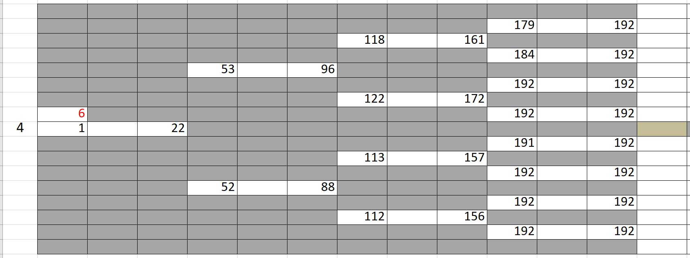

**Overview** - A guide to the tree-hidden Markov model for analyzing heterogeneous cell lineages
===============================================================================================

We present a model to analyze populations of cells where we have one or more phenotypic measurements from, such as cell lifetime, cell fates, cell shape, migration, etc.
The data should be in the form of a lineage binary tree, where each node represents one cell with its measurements.
We have provided a way to create synthetic data in the same format to test the performance of our model.
tHMM uses expectation-maximization (EM) algorithm to cluster the cells based solely on their measurements and their relationship with other cells in a lineage.
Each cluster, aka state, represents a sub-population of cells that belong to a distribution for their observations.
For instance, considering cell lifetime as a measurement, cells that belong to state 1 have the lifetime duration that comes from a Gamma(s1, k1), and cells that belong to state2 have the lifetime duration that comes from a Gamma(s2, k2).
This way, we can quantify phenotypic heterogeneity within a population of cells by revealing each cell's hidden state. Our model, incorporating the cell-cell relationship within each lineage is superior to other clustering methods such as K-means.

We first introduce how to synthesize these populations by working up from the basic unit; cells. We then introduce how to synthesize lineages, which are just hierarchical lineage tree groupings of cells based on their family history. Our model ultimately analyzes populations which are groups of one or more lineages that share the same states.

1. Synthesizing Cells
---------------------

Users will rarely ever have to create individual cells, but their
functionality is presented so the user is familiar with them. Users will
however, create lineages, and as such, they will have to become
comfortable with creating transition matrices using ``numpy``.
Transition matrices define the probabilities of how cells will divide.
Cells can only be made (new cells as a result of an existing cell
dividing) when given a transition matrix. We provide an example below.

The transition matrix defines the rate at which cells are likely to
change from one state to another. We use the defintion of a stochastic
transition rate matrix from Wikipedia, that is, the column index defines
the state in which we start, and the row defines the state at which we
end up. That is, if an element at the index of a transition matrix
:math:`T` at row :math:`i` and at column :math:`j`, is defined as
:math:`T_{i,j}`, then

.. math:: T_{i,j} = \mathbb{P}(z = j | z = i).

$$ T_{i,j} = \mathbb{P}(z = j | z = i)$$

\ Indexing for this matrix and the states starts at :math:`0`. Usually
the number of states is represented as the capital letter :math:`K` and
indexed by the lower-case letter :math:`k`. For most of our examples, we
will deal with two states, i.e., :math:`K=2`.

.. code:: ipython3

    import numpy as np
    # The capital letter T will represent the state transition probability matrix.
    # This transition matrix, in particular, is the two-dimensional 
    # identity matrix. Recall that the elements of the transition matrix
    # represent the probability of transitioning from one state to another.
    T = np.array([[1.0, 0.0],
                  [0.0, 1.0]],  dtype="float")
    # This identity matrix implies that there are no transitions between cells of
    # state 0 to cells of state 1. It also implies that there are no transitions 
    # between cells of state 1 to cells of state 0.
    # Another transition matrix could be the following:
    #
    # T = np.array([[0.75, 0.25],
    #               [0.15, 0.85]], dtype="float")
    #
    # Note that the rows of the transition matrix have to sum one, because of the
    # Law of Total Probability and the Law of Conditional Probability. This will be
    # expanded on in a later notebook.

Cells are defined by their state, their relationships to other cells,
and collections of observations. Knowing how to create cells, however,
is not required by the user. It is beneficial to understand how the
``CellVar`` class is designed to create objects that store a ``state``,
its relationships (``left``, ``right``, ``parent``) to other cells, and
its multivariate observations (``obs``). When cells are created via the
``member`` function, their familiar relationships are automatically
assigned. The two daughters are assigned to ``left`` and ``right`` and
for the daughters, the parent is assigned to ``parent``. Other familiar
relationships can be accessed through other member variables and
functions. Note that the first generation is empty (we can see this
because the ``parent_cell`` is instantiated with ``parent=None`` and
with ``gen=1`` which means that ``gen=0`` of the lineage contains
nothing except ``None``). As such, indexing for generations of lineages
starts at ``1``. We will discuss more about the multivariate
observations that cells store later; for now, the following exercises
will focus on the transition matrix and the familiar relationships of
cells.

.. code:: ipython3

    import numpy as np
    from lineage.CellVar import CellVar as c

    parent_cell = c(state=0, parent=None, gen=1)
    T = np.array([[0.75, 0.25],
                  [0.15, 0.85]], dtype="float")
    left_cell, right_cell = parent_cell.divide(T)

--------------

.. code:: ipython3

    print(parent_cell)
    # <lineage.CellVar.CellVar object at 0x000001A685C55E10>
    print(left_cell, right_cell)
    # <lineage.CellVar.CellVar object at 0x000001A6961B3EF0> <lineage.CellVar.CellVar object at 0x000001A69609C978>
    print(f"\nThe value of the element at (0,0) of the transition rate matrix is {T[0,0]}")
    # The value of the element at (0,0) of the transition rate matrix is 0.75

--------------

The ``gen`` argument for instantiating cells represents the generation
of the cell which start at 1.

--------------

``parent_cell``, ``left_cell``, and ``right_cell`` define a 3-cell
lineage, with 2 generations. The first generation has one cell which was
declared and can be accessed at ``parent_cell``. Calling the member
function ``divide`` on ``parent_cell`` created two new cells which can
be accessed at ``left_cell`` and ``right_cell``. The daughter cells of
any cell can also be accessed using “dot” notation, using the
member variables, ``left`` and ``right``. The division process
utilizes the transition matrix. Our code provides some very basic
printing methods to print out cells. The following code verifies that the ``left_cell`` is actually the left daughter of ``parent_cell``.

.. code:: ipython3

    # Use the `is` keyword to compare Python objects.
    assert left_cell is parent_cell.left

--------------

2. Creating a synthetic lineage
-------------------------------

.. code:: ipython3

    from lineage.LineageTree import LineageTree
    from lineage.states.StateDistributionGamma import StateDistribution

2.1. Defining the :math:`\pi` initial probability vector and :math:`T` stochastic transition rate matrix
--------------------------------------------------------------------------------------------------------

Before, we “hard-coded” that the first cell in our lineage should be
state :math:`0`. In a Markov model, this first state (the state of the
root cell), like the states of the daughter cells, are probabilistically
expressed. These probabilities are stored in the :math:`\pi` initial
probability vector. In particular, if an element of the initial
probability vector , :math:`\pi`, at index :math:`i`, is defined as
:math:`\pi_{i}`, then

.. math:: \pi_{i}=\mathbb{P}(z_{0}=i).

\ We require for :math:`\pi` a :math:`K\times 1` list of probabilities.
These probabilities must add up to :math:`1` and they should be either
in a :math:`1`-dimensional list or a :math:`1`-dimensional numpy array.
An example is shown below.

.. code:: ipython3

    # pi: the initial probability vector
    pi = np.array([0.6, 0.4], dtype="float")
    # Recall that this means that the first cell in our lineage in generation 1 
    # has a 60% change of being state 0 and a 40% chance of being state 1.
    # The values of this vector have to add up to 1 because of the 
    # Law of Total Probability.
    
    # T: transition probability matrix
    T = np.array([[0.75, 0.25],
                  [0.25, 0.75]], dtype="float")

2.2. Defining the :math:`E` emissions matrix using state distributions
----------------------------------------------------------------------

The emission matrix :math:`E` is a little more complicated to define
because this is where the user has complete freedom in defining what
type of observation(s) they care about. In particular, the user has to
first begin with defining what physical observation they will want to
extract from images of their cells, or test on synthetically created
lineages. For example, if one is observing kinematics or physics, they
might want to use the Gaussian distribution parameterized by a mean and
covariance to model their observations (velocity, acceleration, etc.).
If one wanted to model lifetimes of cell, one could utilize a Gamma 
distribution with a shape and scale parameter.
These distributions can then be combined into a multivariate
distribution.

Ultimately, the user needs to provide three things based on the
phenotype they wish to observe, model, and predict:

1. a *probability distribution function*: a function that returns a
   **likelihood** when given a **single random observation** and
   **parameters** describing the distribution
2. a *random variable*: a function that returns **random observations**
   from the distribution when given **parameters** describing the
   distribution
3. an *estimator*: a function that returns **parameters** that describe a
   distribution when given **random observations**

These three things fundamentally define any probability distribution.
For more information about how to define these functions by example, please see "2.stateDistribution.rst".

An optional boolean function can be provided to “censor”
cells based on the observation. In our example, cells with a Bernoulli
observation of :math:`0`, which implies that the cell died, are excluded
from the tree. Another censoring rule we have implemented is removing cells
that were born after an experimental end time.

We have already built, as a starting example, a model that resembles
lineage trees of cancer cells. In our synthetic model, our emissions are
multivariate. This first emission is a Bernoulli observation, :math:`0`
implying death and :math:`1` implying division. The second emission is
continuous RVs and are gamma distributed. Though these can be thought of
cell lifetimes or periods in a certain cell phase, we want the user to
know that these values can really mean anything and they are completely
free in choosing what the emissions and their values mean.

Ultimately, :math:`E` is defined as a :math:`K\times 1` size list of
``stateDistribution`` objects, explained in detail in "2.stateDistribution.rst"

The following code block is a standard way to define state distrbutions
and store them in an emissions list. State distributions are
instantiated via their parameters.

.. code:: ipython3

    # E: states are defined as StateDistribution objects
    
    # State 0 parameters corresponding to the "Resistant" cells
    bern_p0 = 0.99   # bernoulli distribution parameter
    gamma_a0 = 7     # gamma distribution shape parameter
    gamma_scale0 = 7 # gamma distribution scale parameter
    
    # State 1 parameters corresponding to the "Susceptible" cells
    bern_p1 = 0.88
    gamma_a1 = 7
    gamma_scale1 = 1
    
    state_obj0 = StateDistribution(bern_p0, gamma_a0, gamma_scale0)
    state_obj1 = StateDistribution(bern_p1, gamma_a1, gamma_scale1)
    
    E = [state_obj0, state_obj1]

The final required parameters are more obvious. The first is the
number of cells one would like in their full uncensored lineage tree. This
can be any number. Since one of our observations is time-based, we can
also add a censoring condition based on time as well. Ultimately, these
design choices are left up to the user to customize based on their state
distribution type. Without loss of generality, we provide the following
example of a full lineage tree.

.. code:: ipython3

    lineage1 = LineageTree.init_from_parameters(pi, T, E, desired_num_cells=2**5 - 1)
    # These are the minimal arguments required to instantiate lineages
    print(lineage1)
    print("\n")

In the lineage above, note that the cells now have observations. Also
note that you did not have to “hard-code” the first cell and its state.
The first observation in the observation list for each cell is a
Bernoulli observation which can either be 1 or 0. An observatioon of 1
implies that the cell lived. An observation of 0 implies that the cell
died. The second observation in the observation is the gamma observation
and represents the lifetime of the cell. Note that some cells live for
far longer than others. This is because one of the states has a
probability distribution with a gamma distribution that draws longer
times.

3. Analyzing a full lineage
-----------------------------------

Our project’s goal is to analyze heterogeneity. We packaged the main
capability of our codebase into one function ``Analyze``, which runs the
tree-hidden Markov Model on an appropriately formatted dataset. In the
following example, we analyze the full lineage from above.

.. code:: ipython3

    from lineage.Analyze import Analyze
    
    X = [lineage1] # population just contains one lineage
    tHMMobj, pred_states_by_lineage, LL = Analyze(X, 2) # find two states

Estimated Markov parameters (:math:`\pi`, :math:`T`, :math:`E`)

Our model is blind to the true states of the cells
(unlike the code blocks above where we knew the identity of the cells, 
in terms of their state). This model primarily has to segment or
partition the tree and its cells into the number of states we think is
present in our data, and then identify the parameters that describe each
state’s distributions. We can not only check how well it estimated the
state parameters, but also the initial probability vector :math:`\pi`
and transition matrix :math:`T` vector. Note that estimating these also
get better as more lineages are added (for the :math:`\pi` vector in
particular) and in general as more cells and more lineages are added.

.. code:: ipython3

    print(tHMMobj.estimate.pi)

.. code:: ipython3

    print(tHMMobj.estimate.T)

.. code:: ipython3

    for state in range(lineage1.num_states):
        print("State {}:".format(state))
        print("                    estimated state:", tHMMobj.estimate.E[state])
        print("original parameters given for state:", E[state])
        print("\n")

4. Creating a population with multiple lineages:
------------------------------------------------

The following is an analysis run on a larger set of lineages. We first create 10 lineages and append them to a list to form our cell populations.
In this case, we are choosing that all lineages should have 35 cells.
``Analyze()`` takes in the list of populations and the number of states,
and returns the ``tHMMobject``, the list of assigned states ,(``pred_states_by_lineage``) and the likelihood (``LL``) after running the EM algoithm.
The instances of ``tHMMobj`` include the information about the distributions corresponding to each state and phenotypie.
In this case, we are running the ``Analyze`` with 2 states, and we know it is the true number of states,
because we used ``E`` as the Emissions which we defined as a list with two ``StateDistribution``s.

.. code:: ipython3

    from lineage.Analyze import Analyze_list

    Y = []
    for _ in range(10):
        Y.append(LineageTree.init_from_parameters(pi, T, E, desired_num_cells=35))
    tHMMobj, pred_states_by_lineage, LL = Analyze_list(Y, 2) # find two states

.. code:: ipython3

    print(tHMMobj.estimate.pi)

.. code:: ipython3

    print(tHMMobj.estimate.T)

.. code:: ipython3

    for state in range(lineage1.num_states):
        print("State {}:".format(state))
        print("                    estimated state:", tHMMobj.estimate.E[state])
        print("original parameters given for state:", E[state])
        print("\n")

The function ``Results()`` provides calculated features when analyzing a synthetic data.

.. code:: ipython3

    from lineage.Analyze import Results

    results_dict = Results(tHMMobj, pred_states_by_lineage, LL)
    print("total number of cells: ", results_dict["total_number_of_cells"])
    print("\n total number of lineages: ", results_dict["total_number_of_lineages"])
    print("\n transition matrix norm: ", results_dict["transition_matrix_norm"])
    print("\n parameter estimtes: ", results_dict["param_estimates"])
    print("\n accuracy of state assignemnts: ", results_dict["balanced_accuracy_score"])
    print("\n the distance between state 0 and state 1: ", results_dict["wasserstein"])

5. Applications - A guide to use the `tHMM` for imported experimental data.
---------------------------------------------------------------------------

As an application, we fit experimental data of cell cycle phase durations (G1 and S/G2) in response to lapatinib and gemcitabine treatments to analyze the phenotypic heterogeneity.
The data is in the form of binary tree in excel, shown beloow. We have written "lineage/LineageInputOutput.py" to properly import this data and convert it into the format usable for `tHMM`.
The following shows one lineage in the excel sheets. In each row, the difference between the two values corresponding to each cell shows the duration of G1 cell cycle phase, and 
the difference between the second value and the first value of the daughter cell shows the duration of S/G2 cell cycle phase.

.. code:: ipython3

    from lineage.LineageInputOutput import import_exp_data
    from lineage.states.StateDistributionGaPhs import StateDistribution
    from lineage.LineageTree import LineageTree

    desired_num_states = 2 # dummy value just to initialize
    E = [StateDistribution() for _ in range(desired_num_states)]

    # control condition:
    c1 = [LineageTree(list_of_cells, E) for list_of_cells in import_exp_data(path=r"lineage/data/heiser_data/new_version/AU00601_A5_1_V5.xlsx")]
    c2 = [LineageTree(list_of_cells, E) for list_of_cells in import_exp_data(path=r"lineage/data/heiser_data/new_version/AU00601_A5_2_V4.xlsx")]
    c3 = [LineageTree(list_of_cells, E) for list_of_cells in import_exp_data(path=r"lineage/data/heiser_data/new_version/AU00701_A5_1_V4.xlsx")]
    c4 = [LineageTree(list_of_cells, E) for list_of_cells in import_exp_data(path=r"lineage/data/heiser_data/new_version/AU00801_A5_1_V4.xlsx")]
    Control = c1 + c2 + c3 + c4

    from lineage.Analyze import Analyze_list
    tHMMobj_list, pred_states_by_lineage_by_conc, LL = Analyze_list([Control], num_states=3)
    # in this example, we are ran the model with 3 states.

    # finding the number of cells in the lineages:
    total_number_cells = sum([len(lineage.output_lineage) for lineage in tHMMobj_list[0].X])

    print("the likelihood of having 3 states: ", LL)
    print("BIC value for this population: ", [tHMMobj_list[0].get_BIC(LL, total_number_cells)][0])
    print("The degree of freedom: ", [tHMMobj_list[0].get_BIC(LL, total_number_cells)][1])

To find out the likelihood of having different number of states we can use ``run_Analyze_over()`` 
with which we can run the model in parallel (by setting `atonce=True`) for different state numbers to minimize the run time.

To do that, we append the population for the number of states we want to analyze.
The following shows running the model for 1, 2, 3, and 4 states, in parallel, and printing the BIC value for each scenario:

.. code:: ipython3

    from lineage.Analyze import run_Analyze_over
    import numpy as np
    desired_num_states = np.arange(1, 5)
    dataFull = []
    for _ in desired_num_states:
        dataFull.append([Control])

    # Run fitting
    output = run_Analyze_over(dataFull, desired_num_states, atonce=True)
    BICs = np.array([oo[0][0].get_BIC(oo[2], num_cells, atonce=True)[0] for oo in output])

    print("Normalized BIC value based on the minimum: ", BICs - np.min(BICs, axis=0))
